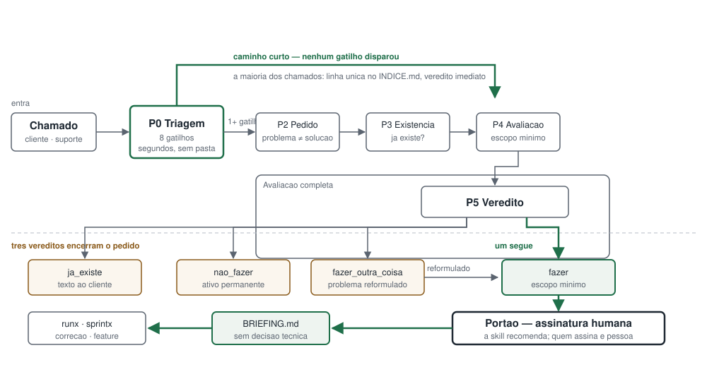

# prodx

<picture>
  <source media="(prefers-color-scheme: dark)" srcset="assets/prodx-fluxo-dark.svg">
  
</picture>

A camada de produto do ecossistema Expx. Fica entre o pedido do cliente e o planejamento técnico, e responde uma pergunta que nenhuma outra skill faz: **vale fazer isso?**

## O problema do trabalho bem feito que não deveria existir

O ecossistema Expx já é bom em fazer trabalho direito. O `sprintx` planeja features com rigor, o `runx` trata ocorrências com disciplina, o `legadox` protege o código legado, o `mergex` entrega, o `memox` lembra.

Todos eles assumem que **o trabalho certo já foi escolhido**.

O sprintx planeja com rigor uma feature que não deveria existir. O runx corrige com disciplina um bug que era comportamento intencional. O legadox protege o código de uma mudança que ninguém pediu.

Numa software house esse é o desperdício mais caro que existe — mais caro que bug, porque bug pelo menos aparece. Trabalho desnecessário bem executado passa em todos os testes, entra em produção, e ninguém nunca descobre que não deveria ter sido feito.

O prodx é o portão que falta.

## A realidade: o pedido vai do suporte direto ao dev

Nesta casa não existe papel de produto formalizado. O chamado chega no suporte e vai para o desenvolvedor, que normalmente tem outros na fila.

Isso governa todo o desenho da skill:

- **Quem roda o prodx é o próprio dev**, entre um chamado e outro. Um processo de cinco etapas por ticket não sobrevive a isso.
- **A skill é o processo que não existe**, não a ferramenta de um processo existente. Por isso ela roda em modo didático: está ensinando um método que ninguém no time pratica ainda.
- **Não há quem assine hoje.** A skill ajuda a estabelecer isso em vez de presumir que já está resolvido.

## A triagem, e por que a maioria dos chamados não deve passar por processo nenhum

A maioria dos chamados de uma software house é trivial: rótulo errado, campo desalinhado, dúvida de uso, erro óbvio.

Rodar avaliação de produto nisso é burocracia, e burocracia é contornada na segunda semana.

Por isso todo pedido começa pela **triagem**: oito gatilhos, resposta sim ou não, poucos segundos, **sem criar pasta nenhuma**. Nenhum gatilho disparou, o pedido sai com veredito imediato e uma linha no índice.

| # | Gatilho |
|---|---------|
| G1 | Pedido do tipo novo, ou pede tela, relatório ou fluxo novo |
| G2 | O pedido descreve uma solução, não um problema |
| G3 | O pedido serve a um cliente só, num produto multi-cliente |
| G4 | O pedido cheira a algo que já existe no sistema |
| G5 | Chegou rotulado como bug mas descreve regra de negócio |
| G6 | Toca zona de risco declarada no perfil do legadox |
| G7 | O mesmo pedido já foi recusado antes |
| G8 | O esforço aparente é maior que alguns dias |

A regra de proporcionalidade vale nos dois sentidos: **proibido** rodar avaliação completa em pedido trivial, e **proibido** pular a avaliação quando um gatilho disparou.

A triagem é a diferença entre uma ferramenta que o dev usa e uma que ele contorna.

## Os quatro vereditos — três deles encerram o pedido

| Veredito | O que acontece |
|----------|----------------|
| **`ja_existe`** | O sistema já faz. Sai um texto para o cliente explicando onde e como, na linguagem dele. **Encerra.** |
| **`nao_fazer`** | Com o motivo registrado, datado e falseável. Quando o pedido voltar, a avaliação já está feita. **Encerra.** |
| **`fazer_outra_coisa`** | O problema real reformulado, quase sempre menor e diferente do pedido. **Encerra o pedido original.** |
| `fazer` | E aí, e só aí, sai o briefing. |

Três dos quatro caminhos terminam sem gerar uma linha de código. Essa é a razão de o prodx existir.

O caso mais comum é o `ja_existe`: cliente pede "relatório de vendas por região" e o sistema tem isso há três anos numa tela que ninguém achou. A verificação de existência é a etapa mais valiosa e a mais ignorada.

## O indicador: a taxa de pedidos que não viram trabalho

**Se tudo que entra sai como "fazer", o prodx é burocracia** e será pulado na segunda semana.

O índice registra a proporção, e a skill a reporta quando perguntada sobre o estado:

```
Pedidos registrados: 48
Via triagem: 37 (77%)
Via avaliacao completa: 11 (23%)
Nao viraram trabalho: 19 (40%)
```

A última linha é o critério honesto de utilidade da skill. A segunda é o indicador de atrito: acima de 50% na avaliação completa, os gatilhos estão largos demais.

## O PRODUTO.md

Sem ele a skill vira genérica, e qualquer IA responderia igual. O `docs/produto/PRODUTO.md` é montado uma vez, atualizado sob demanda, e é o que faz o prodx conhecer **este** produto.

Duas seções fazem quase todo o trabalho:

- **O que o produto deliberadamente NÃO é.** É ela que sustenta a recusa de pedido fora de escopo. Vale mais que a descrição do que o produto é.
- **Quem decide.** O campo do signatário nunca fica vazio, nem como não determinado. Como não existe papel de produto na casa, a skill provoca a definição: pergunta quem, na prática, hoje diria não a um cliente, e registra essa pessoa como signatária provisória.

Ninguém assinando é o mesmo que o prodx não existir: os vereditos viram sugestão que ninguém encampa.

Nada de invenção: o que não for verificável vira `NAO DETERMINADO` e entra em `docs/produto/LACUNAS.md`.

## Estrutura em disco

```
docs/produto/
  PRODUTO.md
  LACUNAS.md
  INDICE.md                append-only, uma linha por pedido
  pedidos/
    <PD-ID>-<slug>/        criada apenas em avaliacao completa
      01-pedido.md
      02-existencia.md
      03-avaliacao.md
      VEREDITO.md
      BRIEFING.md          so quando o veredito for fazer
```

Pedido que passa na triagem não gera pasta. Pedido recusado nunca é apagado: a avaliação vale para a próxima vez.

## Instalação

A skill vive apenas em `.claude/skills/`, que os dois harnesses leem. Os comandos ficam nas duas pastas, com conteúdo idêntico.

### Claude Code

```
cp -r .claude/skills/prodx    <seu-projeto>/.claude/skills/
cp    .claude/commands/prodx*.md <seu-projeto>/.claude/commands/
```

### OpenCode

```
cp -r .claude/skills/prodx      <seu-projeto>/.claude/skills/
cp    .opencode/commands/prodx*.md <seu-projeto>/.opencode/commands/
```

O OpenCode lê skills de `.claude/skills/*/SKILL.md` nativamente. Não crie `.opencode/skills/`: nomes de skill precisam ser únicos entre todas as localizações.

### Comandos

| Comando | Função |
|---------|--------|
| `/prodx` | Roteador: estado, pedidos abertos e indicadores |
| `/prodx-produto` | Cria ou atualiza o `PRODUTO.md` |
| `/prodx-triar` | Triagem de um chamado recém-chegado |
| `/prodx-avaliar` | Avaliação completa, do entendimento ao veredito |
| `/prodx-existe` | Consulta rápida: isso já existe? |
| `/prodx-briefing` | Gera o briefing de um veredito assinado |

## Integração com runx, sprintx e memox

| Skill | Relação |
|-------|---------|
| **runx** | O caminho mais comum, porque hoje o pedido chega pelo suporte. O briefing vira o `00-OCORRENCIA.md`, com o tipo classificado e o comportamento intencional já verificado. Pedido aprovado na triagem entrega um briefing de uma linha. |
| **sprintx** | Recebe o briefing como entrada da F1. O plano referencia o PD-ID de origem. |
| **memox** | Indexa o índice e os vereditos. É ele que faz a verificação de existência melhorar com o tempo. |
| **legadox** | Quando existir perfil, as zonas de risco viram o gatilho G6. |

Os prompts de integração estão em `docs/integracao/`. Nenhum deles altera comportamento quando o prodx não está instalado — o aviso de trabalho sem veredito assinado é aviso, nunca bloqueio.

**A ausência de qualquer skill irmã nunca bloqueia o prodx.**

## O que o prodx NÃO faz

> **Ele não assina.**
>
> O prodx recomenda com evidência, e com força. Quem assina é uma pessoa. Nenhum trabalho segue para o sprintx ou para o runx sem o campo de assinatura preenchido, e a skill nunca preenche esse campo por conta própria.
>
> Esta é a diferença mais importante em relação às skills irmãs: dizer "não" a um cliente tem consequência comercial, e cliente que ouve não e não deveria ter ouvido é cliente perdido.

Além disso:

- **Não planeja implementação.** Isso é sprintx e runx.
- **Não estima esforço.** Isso é a F3.5 do sprintx, e depende do plano.
- **Não fala com o cliente.** Ele produz o texto; quem envia é o atendimento.
- **Não substitui conversa.** Quando a informação não está em lugar nenhum, ele diz o que perguntar a quem, em vez de supor.

## Exemplos

Em `exemplos/`, todos sobre um ERP de software house:

- `triagem.exemplo.md` — três chamados passando direto, em poucas linhas, sem gerar pasta
- `veredito-ja-existe.exemplo.md` — relatório pedido que já existe numa tela pouco conhecida
- `veredito-nao-fazer.exemplo.md` — pedido de cliente único num produto multi-cliente, recusado com motivo que continua válido
- `briefing.exemplo.md` — escopo mínimo bem menor que o pedido
- `PRODUTO.exemplo.md` — o contexto de produto que sustenta os três anteriores

## Licença

MIT. Veja `LICENSE`.
